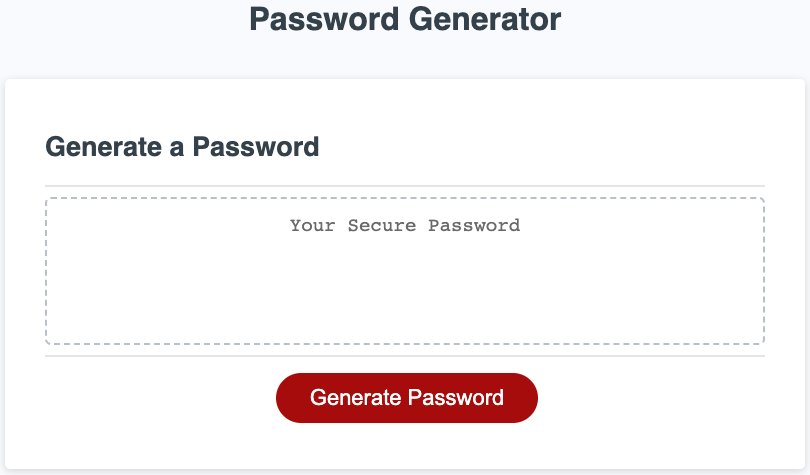
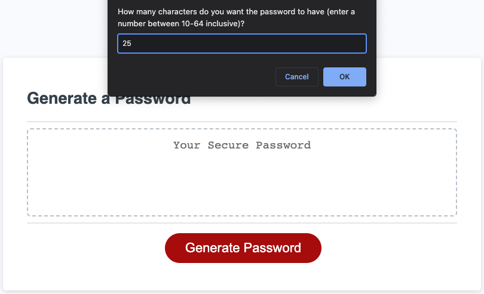
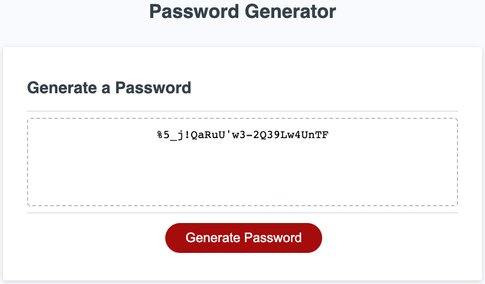

# Unit 5 Challenge: Password Generator

## Description

A JavaScript-heavy app that generates a random password based on user input.

The user specifies the length and the character types (uppercase, lowercase, numeric and special) to be included in the generated password.

Both the number of characters to be included from each character type (so that the total is the specified length) and the characters themselves are randomly selected. The composition of the password string is also randomised further.

In working on this app, I practised translating pseudocode into JavaScript, and relied heavily on searching online to find useful solutions to problems around randomising numbers, strings and arrays using JavaScript.

## Installation

N/A

## Usage

The password generator can be accessed from the link below.

https://stellar-zuccutto-4049a9.netlify.app/

After clicking on the 'Generate Password' button, the user is presented with a series of prompts to determine the criteria they require for the password. To proceed, they must enter a valid length between 10 and 64 characters (inclusive) and they must specify at least one character type to be included (uppercase, lowercase, numeric and special). The user is then presented with the generated password in the main text area above the button.

Passwords can be generated as many times as needed without refreshing, and the process can be exited by the user by clicking Cancel at the appropriate prompts.

Screenshots of the generator are shown below.

## Credits

[Random numbers that add up to a certain number](https://forum.pdpatchrepo.info/topic/12561/random-numbers-that-add-up-to-a-certain-number/6#:~:text=ingox-,A%20nice%20solution,-has%20been%20proposed) - a cool idea in a forum thread discussing different approaches on how to get random numbers to add up to a certain number. It served as inspiration to the approach I took for one aspect of app.

The HTML and CSS were provided by the course and not created by myself.

## License

Licensed under the [MIT](https://opensource.org/licenses/MIT) license.

## Badges

